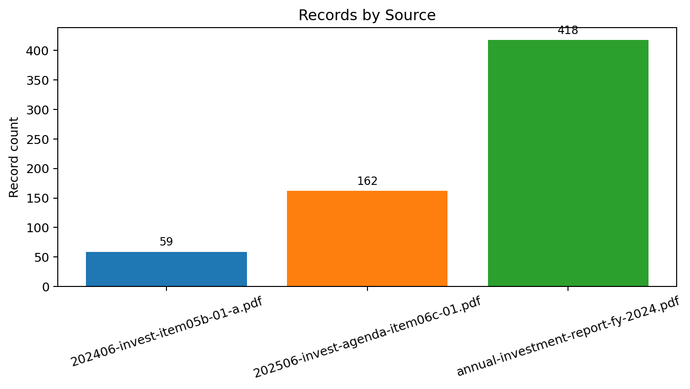

# Private Markets PDF Extraction & Normalization Pipeline

This project is a public-data reconstruction of a real private-markets data-operations problem: analysts and data teams often need to extract performance information from inconsistent PDFs before they can do any downstream analytics.

The goal here is not to pretend that every PDF can be universally parsed. The goal is to show a credible, auditable workflow that:

- acquires a small reproducible set of public CalPERS private-equity-related reports
- extracts candidate rows with `camelot` and `pdfplumber`
- normalizes them into a standard schema
- preserves provenance back to source file and page
- validates suspicious rows instead of silently trusting them
- produces dashboard-ready outputs and portfolio-ready artifacts



## Why this project matters

Private markets still have a document-ops bottleneck.

Even when the source is public, the underlying workflow looks a lot like internal LP reporting operations:

- metrics are trapped in PDF tables or narrative pages
- layouts differ across document types
- some sources expose fund-level holdings, others only aggregate program metrics
- the same concept can appear under different labels
- downstream users need traceability back to the original source page

That is the point of this repo. It is not just a dashboard project. It is a reconstruction of the messy middle layer between source documents and analytics.

## What this pipeline does

1. Downloads or inventories public CalPERS source documents.
2. Discovers local PDFs in `data/raw_pdfs/`.
3. Extracts page text with `pdfplumber`.
4. Attempts table extraction with `camelot` using `stream` and `lattice`.
5. Parses candidate rows with source-aware heuristics.
6. Normalizes outputs into a shared fund-level schema.
7. Validates rows and flags suspicious values.
8. Produces dashboard-ready datasets, sample tables, and source-quality audit artifacts.

## Data sources used

Starter CalPERS dataset in [`data/raw_pdfs/`](data/raw_pdfs/):

- `202406-invest-item05b-01-a.pdf`
  CalPERS Private Equity Annual Program Review as of March 31, 2024
- `202506-invest-agenda-item06c-01.pdf`
  CalPERS Private Equity Annual Program Review as of December 31, 2024
- `annual-investment-report-fy-2024.pdf`
  CalPERS 2023-24 Annual Investment Report

Supporting discovery pages saved as HTML:

- `calpers_private_equity_program_fund_performance_page.html`
- `calpers_private_equity_program_fund_performance_print.html`
- `calpers_investment_financial_reports_page.html`

See [`docs/source_inventory.md`](docs/source_inventory.md) for the exact URLs and local file mapping.

## Real outputs from the current run

Current generated outputs:

- 639 normalized records in [`data/normalized/fund_records_validated.csv`](data/normalized/fund_records_validated.csv)
- 639 dashboard records in [`data/normalized/dashboard_records.csv`](data/normalized/dashboard_records.csv)
- 17 validation issues in [`outputs/logs/validation_issues.csv`](outputs/logs/validation_issues.csv)
- source quality audit in [`outputs/samples/source_quality_audit.md`](outputs/samples/source_quality_audit.md)
- high-confidence sample rows in [`outputs/samples/high_confidence_sample.csv`](outputs/samples/high_confidence_sample.csv)

Headline result:

- The cleanest current source is the CalPERS annual investment report.
- Its private-equity holdings section on pages 310-320 follows a stable `Security Name / Book Value / Market Value` format.
- That section currently yields 418 high-confidence fund-level rows with reliable `fund_name`, `page_number`, and market-value-to-`nav` mapping.

## Source-quality audit

Source-level quality snapshot:

| Source file | Record count | Unique fund names | High-confidence rows | Flagged review rows | Current interpretation |
| --- | ---: | ---: | ---: | ---: | --- |
| `annual-investment-report-fy-2024.pdf` | 418 | 418 | 418 | 0 | Cleanest fund-level extraction; stable holdings layout |
| `202506-invest-agenda-item06c-01.pdf` | 162 | 139 | 0 | 10 | Useful but still mostly aggregate program-review extraction |
| `202406-invest-item05b-01-a.pdf` | 59 | 49 | 0 | 7 | Useful but still mostly aggregate program-review extraction |

Detailed populated-field rates by source are in [`outputs/samples/source_quality_audit.csv`](outputs/samples/source_quality_audit.csv).

## What worked best

The annual investment report worked best because it contains a repeated holdings layout with:

- a stable section title: `Private Equity`
- a stable header: `Security Name Book Value Market Value`
- line-level fund rows that can be parsed conservatively

For those rows, the pipeline:

- extracts `fund_name`
- maps `Market Value` to `nav`
- preserves the full original row in `raw_row_text`
- retains `source_file`, `page_number`, and `extraction_method`
- marks the rows `high` confidence with an explicit provenance note:
  `annual_report_market_value_mapped_to_nav`

## What remains hard

The two annual program review PDFs are still the hard part, which is exactly what makes this a credible private-markets data-ops project.

Those documents contain:

- charts and strategy-mix visuals
- benchmark and return commentary
- aggregate portfolio metrics
- multi-line narrative plus table fragments

They do not currently yield clean, repeatable fund-level rows at the same quality as the annual investment report. The pipeline still captures extraction artifacts and normalized candidates from them, but many of those rows remain low-confidence or review-worthy.

That mirrors the actual operational problem: some sources are structurally extractable and some still need source-specific logic plus analyst review.

## Normalized schema

Core output schema:

- `source_name`
- `source_file`
- `report_date`
- `page_number`
- `fund_name`
- `vintage_year`
- `committed_capital`
- `contributed_capital`
- `distributed_capital`
- `nav`
- `tvpi`
- `dpi`
- `irr`
- `currency`
- `raw_row_text`
- `extraction_method`
- `confidence_flag`
- `notes`

See [`docs/schema.md`](docs/schema.md).

## Portfolio artifacts

Useful project artifacts for review:

- source audit: [`outputs/samples/source_quality_audit.md`](outputs/samples/source_quality_audit.md)
- high-confidence sample rows: [`outputs/samples/high_confidence_sample.md`](outputs/samples/high_confidence_sample.md)
- records by source: [`outputs/figures/records_by_source.html`](outputs/figures/records_by_source.html)
- field completeness by source: [`outputs/figures/field_completeness_by_source.html`](outputs/figures/field_completeness_by_source.html)
- top extracted funds by NAV / market value: [`outputs/figures/top_funds_by_nav.html`](outputs/figures/top_funds_by_nav.html)
- confidence flag distribution: [`outputs/figures/confidence_flag_distribution.html`](outputs/figures/confidence_flag_distribution.html)
- validation issue breakdown: [`outputs/figures/validation_issue_breakdown.html`](outputs/figures/validation_issue_breakdown.html)

## Repository structure

```text
.
├── README.md
├── requirements.txt
├── data/
├── src/
├── app/
├── notebooks/
├── outputs/
└── docs/
```

Main code entry points:

- [`src/download_calpers_pdfs.py`](src/download_calpers_pdfs.py)
- [`src/extract_text.py`](src/extract_text.py)
- [`src/extract_tables.py`](src/extract_tables.py)
- [`src/parse_metrics.py`](src/parse_metrics.py)
- [`src/normalize_schema.py`](src/normalize_schema.py)
- [`src/validate_records.py`](src/validate_records.py)
- [`src/build_dashboard_data.py`](src/build_dashboard_data.py)
- [`src/build_portfolio_artifacts.py`](src/build_portfolio_artifacts.py)

## How to run

```bash
python3 -m venv .venv
source .venv/bin/activate
pip install -r requirements.txt
python src/download_calpers_pdfs.py
python src/discover_pdfs.py
python src/extract_text.py
python src/extract_tables.py
python src/parse_metrics.py
python src/normalize_schema.py
python src/validate_records.py
python src/build_dashboard_data.py
python src/build_portfolio_artifacts.py
streamlit run app/streamlit_app.py
```

## Limitations

- This is not a universal PDF parser.
- OCR-heavy scanned documents are not handled in v1.
- `nav` values from the annual investment report are derived from `Market Value`, not true LP statement NAV.
- The annual program review PDFs are only partially normalized and still contain aggregate/noisy rows.
- `dpi` is not yet meaningfully recovered in the current source set.

Those are real limitations, and they are documented rather than hidden.

## Why this mirrors a real private-markets data-ops challenge

This project shows the actual shape of the work:

- document acquisition matters
- layout quality determines extraction quality
- provenance matters as much as parsing
- some sources can be automated confidently
- some sources still need analyst review

That is the operational bottleneck in private markets: not every important number arrives in a clean dataset, and the hard part is building an auditable bridge from messy reporting to usable analytics.

## Next best improvement

The highest-value next step is source-specific parsing for the two annual program review PDFs so they produce clean program-level metric tables with fewer false positives and more trustworthy `tvpi` / `irr` rows.
